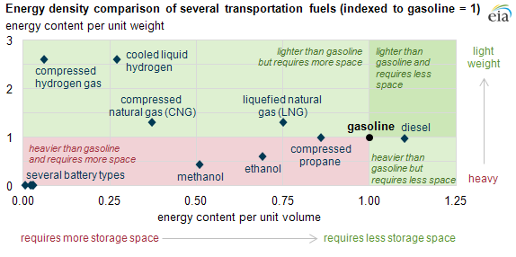
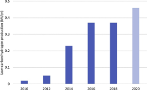
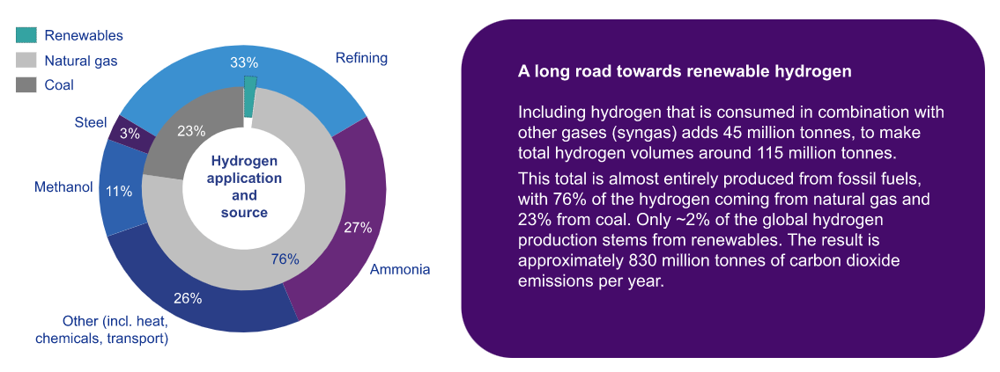
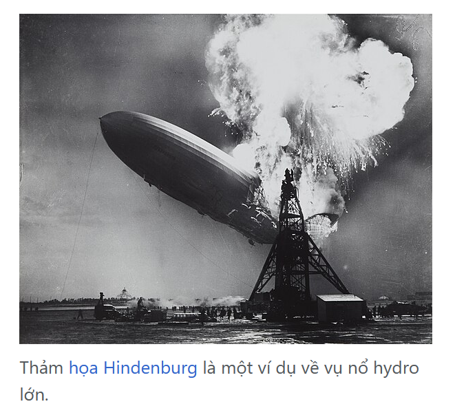
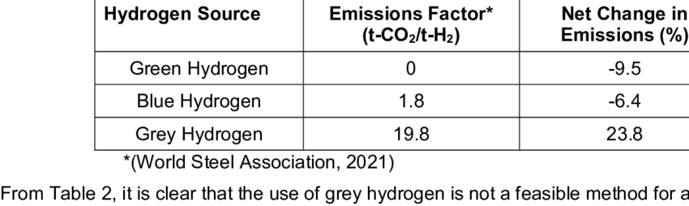
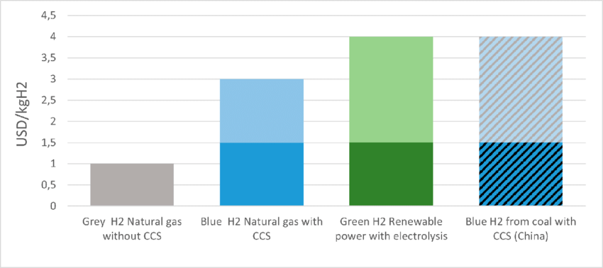
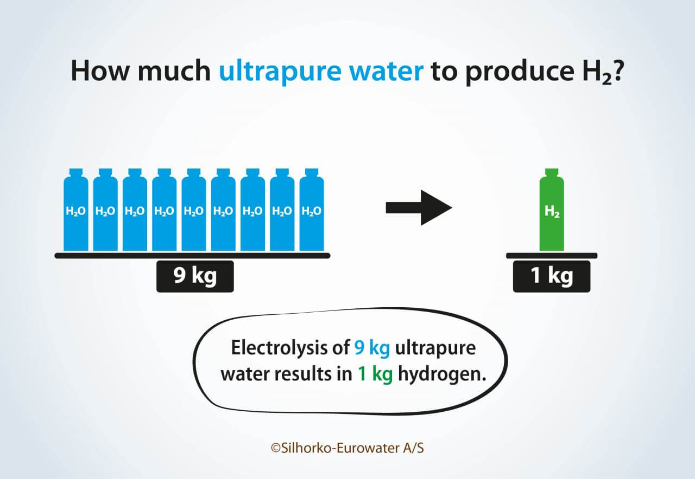

# trans

**5.1 Hạn chế chung của năng lượng hydrogen:**

Mặc dù có tiềm năng trở thành nguồn năng lượng sạch, hydro vẫn đối mặt với nhiều thách thức cản trở việc áp dụng rộng rãi:

1. **Đòi hỏi nhiều năng lượng ở quá trình sản xuất:**
    
    Hydro không tồn tại sẵn ở dạng tinh khiết và cần một lượng năng lượng đáng kể để chiết xuất. Các phương pháp như tái tạo hơi metan, điện phân nước và khí hóa sinh khối đều yêu cầu đầu vào năng lượng lớn, làm giảm lợi ích môi trường nếu nguồn năng lượng không đến từ các nguồn tái tạo.
    
    Hiện nay, ngành công nghiệp hydro đang dần phát triển với khoảng 75 cơ sở sản xuất hydro đang hoạt động trên toàn cầu, cùng với 150 cơ sở khác đang trong giai đoạn lập kế hoạch phát triển, chủ yếu tập trung tại các quốc gia như Hoa Kỳ, Nhật Bản, và châu Âu. Riêng tại Hoa Kỳ, sản lượng hydro hàng năm đạt khoảng 9 triệu tấn, đủ để:
    
    - Cung cấp năng lượng cho 20–30 triệu chiếc ô tô, hoặc
    - Cung cấp điện và nhiệt cho 5–8 triệu ngôi nhà.
    
    Tuy nhiên, sản lượng này chỉ đáp ứng khoảng 18% nhu cầu năng lượng toàn cầu, cho thấy sự phụ thuộc vào hydro vẫn còn rất hạn chế. Điều này phản ánh rằng, dù hydro có tiềm năng lớn trong việc thay thế nhiên liệu hóa thạch, việc mở rộng quy mô sản xuất, cải thiện hiệu suất, và giảm phụ thuộc vào nguồn năng lượng không tái tạo vẫn là những thách thức cần giải quyết.
    
2. **Khó khăn trong lưu trữ và vận chuyển:**
    
    Một trong những hạn chế lớn nhất là mật độ năng lượng thể tích thấp của hydro. Khi không được nén, năng lượng chứa trong 1 lít hydro chỉ bằng khoảng một phần tư năng lượng của cùng một thể tích xăng. Điều này có nghĩa là để đạt được cùng một lượng năng lượng, cần một thể tích hydro lớn hơn nhiều, gây ra vấn đề về không gian lưu trữ.
    
    Khi hydro được nén thành chất lỏng ở nhiệt độ cực thấp (khoảng -253°C), mật độ năng lượng tăng lên đáng kể, thậm chí cao hơn gấp ba lần so với xăng. Tuy nhiên, quy trình nén này đòi hỏi hệ thống làm lạnh và cách nhiệt phức tạp, làm tăng đáng kể chi phí vận hành. Ngoài ra, việc duy trì hydro ở trạng thái lỏng cũng gặp thách thức lớn do thất thoát nhiệt và hiện tượng hóa hơi, đặc biệt trong quá trình vận chuyển đường dài.
    
    Việc lưu trữ hydro ở dạng khí cũng cần áp suất cực cao (thường trên 700 bar) để giảm thể tích và tăng khả năng chứa. Điều này đòi hỏi các bình chứa được thiết kế đặc biệt với vật liệu chịu áp lực cao, làm tăng chi phí sản xuất và bảo trì. Hơn nữa, áp suất cao đồng nghĩa với nguy cơ rò rỉ hoặc nổ trong trường hợp xảy ra lỗi kỹ thuật, dẫn đến rủi ro an toàn nghiêm trọng.
    
    Các vấn đề vận chuyển hydro cũng tương tự phức tạp. Việc xây dựng hệ thống đường ống dẫn hydro chuyên dụng cần đầu tư lớn và đòi hỏi vật liệu chịu được tính chất ăn mòn và độ thẩm thấu cao của hydro. Ngoài ra, việc vận chuyển hydro bằng xe tải hoặc tàu biển cũng đặt ra thách thức vì yêu cầu hệ thống chuyên biệt, không chỉ để đảm bảo an toàn mà còn duy trì trạng thái áp suất hoặc nhiệt độ phù hợp.
    
    
    
3. **Chi phí cho việc sản xuất Hydro còn khá cao**:

Chi phí sản xuất hydro hiện nay dao động trong khoảng từ 0.96 USD/kg (đối với các quy trình rẻ nhất) đến 6.64 USD/kg, tùy thuộc vào phương pháp và nguồn năng lượng sử dụng. Điều này đặt ra một rào cản lớn khi so sánh với giá thành rẻ hơn của nhiên liệu hóa thạch, vốn đã có cơ sở hạ tầng hỗ trợ rộng rãi. Ngay cả khi nhận được trợ cấp từ chính phủ hoặc các chương trình hỗ trợ phát triển năng lượng tái tạo, hydro xanh – sản phẩm được tạo ra từ các nguồn năng lượng tái tạo – vẫn khó có thể cạnh tranh về mặt kinh tế với nhiên liệu hóa thạch truyền thống.

Để đáp ứng nhu cầu ngày càng tăng và cắt giảm chi phí, hầu hết hydro hiện nay được sản xuất thông qua các quy trình rẻ nhất, mà không quan tâm nhiều đến tác động môi trường. Trong đó, tái tạo hơi metan (SMR) từ khí tự nhiên là phương pháp thương mại hóa phát triển nhất và ít tốn kém nhất. Tuy nhiên, quá trình này lại đi kèm với những hậu quả nghiêm trọng đối với môi trường, khi thải ra một lượng lớn khí CO₂ – khoảng 10 tấn CO₂ cho mỗi tấn hydro sản xuất ra. Tính tổng cộng, khoảng 900 triệu tấn CO₂ được thải vào khí quyển mỗi năm chỉ từ việc sản xuất hydro, chiếm một tỷ lệ đáng kể trong lượng khí thải nhà kính toàn cầu.

Trong bối cảnh các vấn đề môi trường đang ngày càng trở nên cấp bách, mối quan tâm đến việc sản xuất hydro carbon thấp (như hydro xanh hoặc hydro xanh dương) đã tăng lên. Hydro xanh dương – sản xuất từ khí tự nhiên nhưng có áp dụng công nghệ thu hồi và lưu trữ carbon (CCS) – được coi là một bước trung gian khả thi trong quá trình chuyển đổi năng lượng sạch. Tuy nhiên, chi phí đầu tư ban đầu cho CCS và các cơ sở hạ tầng liên quan lại khiến giá thành của hydro xanh dương và xanh vẫn ở mức cao hơn so với phương pháp truyền thống.

**d. Mối lo ngại về an toàn**: 

Hydro, dù có nhiều ưu điểm như tính sạch và tiềm năng làm nguồn năng lượng thay thế, lại mang theo những nguy cơ an toàn lớn do tính dễ cháy của nó. Khi bị rò rỉ, hydro có thể tích tụ nhanh chóng trong môi trường kín và tạo ra hỗn hợp dễ cháy với không khí, dẫn đến nguy cơ nổ nếu gặp phải nguồn lửa hoặc tia lửa điện. Mặc dù khí hydro có đặc tính khuếch tán rất nhanh trong không khí, giúp làm giảm một phần nguy cơ cháy nổ trong môi trường mở, nhưng điều này không đồng nghĩa với việc các sự cố về an toàn có thể được loại trừ hoàn toàn.

Kích thước phân tử nhỏ của hydro là yếu tố quan trọng gia tăng nguy cơ rò rỉ. Các phân tử hydro có thể dễ dàng thoát qua các khe hở nhỏ mà các chất khí khác không thể, bao gồm cả các hệ thống chứa và đường ống. Điều này đòi hỏi hệ thống lưu trữ, vận chuyển và phân phối hydro phải được thiết kế cực kỳ chặt chẽ và có khả năng chịu áp lực cao để tránh sự rò rỉ.

Để đảm bảo an toàn, các yêu cầu về thiết bị và công nghệ giám sát đối với hydro trở nên rất quan trọng. Các hệ thống phát hiện rò rỉ hydro hiện đại sử dụng các cảm biến khí đặc biệt và công nghệ quang học để phát hiện sự thay đổi trong nồng độ khí trong không khí. Các công nghệ này phải đảm bảo có khả năng phản ứng nhanh chóng, thông báo kịp thời cho người vận hành để giảm thiểu các sự cố. Đồng thời, việc sử dụng vật liệu lưu trữ và ống dẫn có tính chịu áp lực cao, chống ăn mòn và khả năng làm việc hiệu quả trong các điều kiện cực kỳ khắc nghiệt là một yếu tố không thể thiếu.

**5.2 Thách thức riêng của từng loại:**

1. **Hydrogen xám:**
    - **Phụ thuộc vào nhiên liệu hóa thạch**
        
        Hydro xám được sản xuất chủ yếu từ khí tự nhiên (methane), khiến ngành công nghiệp này duy trì sự phụ thuộc vào nhiên liệu hóa thạch. Điều này không chỉ làm gia tăng áp lực khai thác tài nguyên mà còn gây ra các tác động tiêu cực như suy giảm tài nguyên thiên nhiên và phá hủy hệ sinh thái. Bên cạnh, việc khai thác khí tự nhiên thường đi kèm với các vấn đề như rò rỉ methane trong quá trình vận chuyển và xử lý. Methane là một khí nhà kính mạnh, có tác động gây hiệu ứng nhà kính cao gấp 25 lần so với CO2 trong chu kỳ 100 năm, làm gia tăng biến đổi khí hậu.
        
    - **Ảnh hưởng tới môi trường:**
        
        Quá trình cải tạo hơi methane tạo ra một lượng lớn khí CO2. Trung bình, để sản xuất 1 tấn hydro xám, có thể thải ra 10 tấn CO2. Với việc hydro xám chiếm hơn 95% lượng hydro được sản xuất toàn cầu, tác động này đang đóng góp một phần không nhỏ vào lượng khí thải nhà kính trên thế giới. Ngoài CO2, quy trình này cũng tạo ra các khí thải khác như NOx và SOx, góp phần gây ô nhiễm không khí và mưa axit, làm tổn hại đến sức khỏe con người và hệ sinh thái.
        
    - Chi phí thấp nhưng không bền vững
        
        Hydro xám có chi phí sản xuất tương đối thấp, dao động từ 1–2 USD/kg . Tuy nhiên, ****việc phụ thuộc vào khí tự nhiên và phát thải CO2 lớn khiến hydro xám không phải là giải pháp lâu dài trong bối cảnh thế giới đang chuyển dịch sang các nguồn năng lượng sạch. Việc tiếp tục đầu tư vào hydro xám có thể tạo ra rủi ro về mặt kinh tế khi các chính sách môi trường ngày càng khắt khe.
        
        
        

**b. Hydrogen xanh:**

- **Phụ Thuộc Vào Nhiên Liệu Hóa Thạch**
    
    Hydro xanh dương chủ yếu dựa vào khí tự nhiên làm nguyên liệu đầu vào, điều này đồng nghĩa với việc tiếp tục khai thác và sử dụng nguồn tài nguyên hữu hạn này. Khí tự nhiên được khai thác thông qua các phương pháp như fracking (nứt vỡ thủy lực), vốn đã bị chỉ trích vì gây ra những hậu quả nghiêm trọng như ô nhiễm nguồn nước ngầm, suy thoái đất đai và rủi ro địa chấn. Ngoài ra, quá trình vận chuyển khí tự nhiên bằng đường ống hoặc tàu biển cũng phát sinh lượng khí nhà kính đáng kể dưới dạng khí methane, một loại khí gây hiệu ứng nhà kính mạnh gấp nhiều lần so với CO2.
    
- **Hiệu Quả Thu Hồi Carbon Không Hoàn Toàn**
    
    Các công nghệ thu hồi và lưu trữ carbon (CCUS) được sử dụng trong sản xuất hydro xanh dương hiện tại thường chỉ đạt hiệu suất thu hồi từ 70-90%. Điều này đồng nghĩa với việc một phần lớn CO2 vẫn được thải trực tiếp vào khí quyển. Ví dụ, trong một nghiên cứu tại các nhà máy sản xuất hydro ở Bắc Mỹ, hiệu suất thu hồi CO2 chỉ đạt trung bình khoảng 85%, khiến mỗi kilogram hydro xanh dương vẫn tạo ra từ 1 đến 1.5 kg CO2 thải ra môi trường. Những con số này làm cho hydro xanh dương vẫn còn kém xa so với mục tiêu phát thải ròng bằng 0.
    
- **Thách Thức Kinh Tế**
    
    Chi phí sản xuất hydro xanh dương cao hơn đáng kể so với hydro xám (hydro từ khí tự nhiên mà không có công nghệ CCUS). Theo một báo cáo của IEA, chi phí trung bình cho việc sản xuất 1 kg hydro xanh dương dao động từ 1.5 đến 2.5 USD, cao hơn khoảng 30-50% so với hydro xám. Trong khi đó, hydro xanh dương lại chưa thể đạt mức chi phí cạnh tranh với nhiên liệu hóa thạch như dầu mỏ hoặc than đá, đặc biệt tại các quốc gia đang phát triển, nơi giá năng lượng rẻ hơn nhưng yêu cầu môi trường lại không được ưu tiên.
    
- **Hao Tốn Năng Lượng**
    
    Việc áp dụng công nghệ CCUS không chỉ làm giảm hiệu quả sản xuất hydro mà còn tiêu tốn lượng lớn năng lượng bổ sung. Để thu hồi và nén CO2, các nhà máy cần tiêu thụ thêm từ 10-15% năng lượng so với quy trình sản xuất hydro thông thường. Đáng chú ý, nếu nguồn năng lượng cung cấp cho quá trình này đến từ nhiên liệu hóa thạch, thì lượng phát thải gián tiếp từ quá trình sản xuất hydro có thể tăng lên đáng kể. Điều này làm giảm đáng kể lợi ích môi trường của hydro xanh dương.
    
    
    

 **c. Hydrogen xanh lá** Dù đầy hứa hẹn, công nghệ hydro xanh vẫn đang trong giai đoạn phát triển ban đầu,dẫn đến nhiều hạn chế:

- **Chi Phí Sản Xuất Cao:** Một trong những nhược điểm lớn nhất của hydro xanh là **chi phí sản xuất cao** so với các dạng hydro khác như hydro xám hoặc xanh dương:
    - **Chi Phí Vốn**
        
        Việc sản xuất hydro xanh đòi hỏi các thiết bị điện phân đắt tiền, như Polymer Electrolyte Membrane (PEM) hoặc Solid Oxide Electrolysis Cells (SOEC), cùng với hạ tầng năng lượng tái tạo hiện đại. Những công nghệ này có giá thành cao, khiến các dự án sản xuất hydro xanh yêu cầu nguồn đầu tư lớn ngay từ ban đầu.
        
    - **Chi Phí Vận Hành**
        
        Quy trình điện phân nước, dù sạch, tiêu thụ một lượng lớn điện năng. Mặc dù giá năng lượng tái tạo đang giảm, nhưng chi phí sản xuất hydro xanh vẫn dao động từ 3–6 USD/kg, cao hơn nhiều so với hydro xám (1–2 USD/kg).
        
    - **Quy Mô Kinh Tế**
        
        Do thiếu các cơ sở sản xuất quy mô lớn, chi phí sản xuất hydro xanh bị đẩy cao hơn vì không thể tận dụng lợi thế kinh tế theo quy mô. Hiện tại, số lượng nhà máy sản xuất hydro xanh quy mô lớn còn hạn chế, khiến tính khả thi về tài chính của hydro xanh vẫn là một thách thức lớn.
        
- **Phụ thuộc vào năng lượng tái tạo:**

Sản xuất hydro xanh hoàn toàn phụ thuộc vào các nguồn năng lượng tái tạo như gió, mặt trời và thủy điện, điều này dẫn đến một số vấn đề:

- Sự gián đoạn nguồn cung
    
    Nguồn năng lượng tái tạo phụ thuộc vào thời tiết, dẫn đến sự biến động trong cung cấp điện. Những gián đoạn này ảnh hưởng trực tiếp đến sự ổn định và hiệu quả của quá trình điện phân. Ví dụ, sản xuất hydro xanh ở các khu vực có mùa đông kéo dài hoặc nhiều ngày âm u thường không ổn định.
    
- Giới hạn về hạ tầng
    
    Để ổn định nguồn cung, cần đầu tư lớn vào các hệ thống lưu trữ năng lượng (như pin) và nâng cấp lưới điện. Điều này không chỉ làm tăng chi phí mà còn đòi hỏi thời gian triển khai lâu dài, đặc biệt ở những khu vực có hạ tầng năng lượng yếu.
    
- Hạn chế về địa lý
    
    Việc sản xuất hydro xanh khả thi hơn ở các khu vực có nguồn tài nguyên tái tạo dồi dào. Các quốc gia thiếu ánh sáng mặt trời ổn định hoặc tốc độ gió cao sẽ gặp nhiều khó khăn trong việc triển khai hydro xanh trên diện rộng.
    
- **Vấn đề trong việc sử dụng nước:**
    
    Sản xuất hydro xanh thông qua quá trình điện phân đòi hỏi một lượng nước đáng kể . Để sản xuất 1 kg hydro, cần khoảng 9 lít nước tinh khiết. Ở các khu vực đang trải qua tình trạng thiếu nước, nhu cầu này có thể gây thêm áp lực lên môi trường và xã hội. Chẳng hạn, tại các quốc gia Trung Đông, nơi nguồn nước đã khan hiếm, việc sản xuất hydro xanh có thể làm trầm trọng thêm tình trạng này.
    
    Đồng thời nước sử dụng trong điện phân cần phải được lọc tinh khiết để đảm bảo hiệu suất tối ưu. Điều này làm tăng thêm chi phí và sự phức tạp trong sản xuất. Việc sử dụng nước biển hoặc nước mặn yêu cầu quy trình khử muối, vốn tiêu tốn nhiều năng lượng và tài chính, khiến chi phí sản xuất hydro xanh tăng cao.
    

